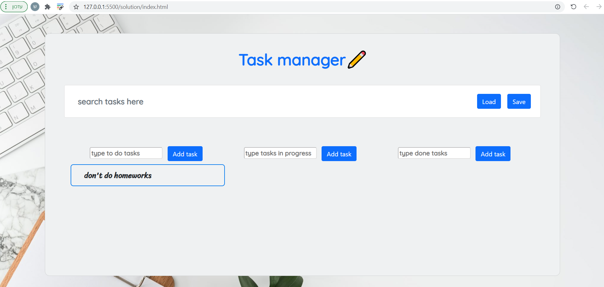
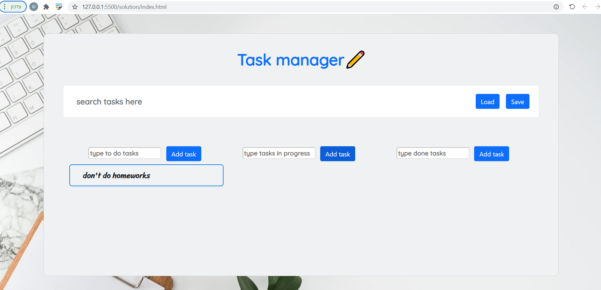
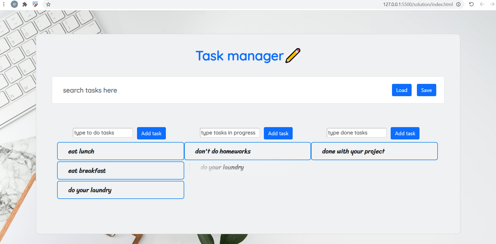

# Cyber4s 3rd Pre-Course Final Project

## What we will be building

We are going to build a task-management application.

### Welcome to task manager !

- In this screen shot you can see i added some tasks for example.
  the features included in this website are:

## Interaction

◼ You can add new tasks by writing the task in the input and pressing the add button:

### Before adding new task

### After adding new task

◼ You can add new tasks by writing the task in the input and pressing the add button:

### Alert messege after adding an empty task

◼ You can re-edit a task by double clicking the task you want to add.

### Before edit task

### After edit task

◼ You can move tasks from one list to another by clicking the wanted task and then pressing "alt+ number"
the number should be 1,2 or 3 depending on the list you want to be the destination.

### Before move task

### After move task

◼ A global search bar that shows you only the tasks that includes the characters written inside the input.

### Before using the search bar

### After using the search bar

## Bonuses

### \* I used the "Bootstrap" library for couple of things for the CSS

◼ The user allowed to drag tasks and drop them in another lists.

### Before using the search bar

### After using the search bar

◼ The user is able to save and load the data in this api -
"https://json-bins.herokuapp.com/bin/614b27c34021ac0e6c080cf8".
In addition, while the data is processed an loader indicator shows up.

### While save/load the data

### Api after save the data

### link to GitHub pages - https://sagigolan8.github.io/kanban-final/

#### Passed all tests
